# Project Report: Covid-19 Data Dashboard

## 1. <b>Data</b>

Two datasets, "owid-covid-data" and the "us_state_vaccinations" data were explored through EDA (exploratory data analysis) using python as the preliminary step to building this project. 

File "eda.ipynb" contains steps carried out as part of EDA and initial data processing. The content of the "eda.ipynb" file is summarized below.

The contents of "eda.ipynb" at a glance is as follows.

* 1. Exploring Dataset 1
     * 1.1. Read Data
     * 1.2. Attributes of Interest
     * 1.3. Data Processing
     * 1.4. Pattern Recognition
     * 1.5. Experimental Zone
     * 1.6. Save Data
* 2. Exploring Dataset 2
     * 2.1. Read Data
     * 2.2. Attributes of Interest
     * 2.3. Experimental Zone

After exploring the 1st dataset, it was decided that this would likely be the data set to be used for this project. This decision was finalized upon loading the second dataset and viewing its features. So, with the second dataset, EDA was not as extensive as with the first dataset.

EDA and data processing with the 1st dataset was as follows.

**1.1. Read Data**

* This section consisted of reading the data stored in a csv file and then converting it into a pandas dataframe for easier analysis.

* A dateparse function was written so that while reading the data, the "date" column would be interpretted as having type "pandas timestamp" instead of "string".

* It was found that the dataset contained 164482 smples with 67 features.

* It was interesting to note that every row contained at least 1 "NaN" value which means in this case, rows with "NaN" values could not just simply be dropped as this would result in an empty dataset. Thus the NaN were left untouched and were later replaced with 0s as was seen fit in the javascript file. 

**1.2. Attributes of Interest**

* To determine how to and what part of data to display, it is necessary to undwestand what the data means. Thus, the documentation regarding each attribute given at https://github.com/owid/covid-19-data/tree/master/public/data was read carefully after which the following 22 attributes were deemed to be the attributes that were most likely to be useful for building of the dashboard. The type of the attribute (numeric/not) was also determined.
  
  | #   | Attribute               | Type              | Description                                                                                                                                                                                                          |
  | --- | ----------------------- | ----------------- | -------------------------------------------------------------------------------------------------------------------------------------------------------------------------------------------------------------------- |
  | 1   | new_cases               | numeric           | New confirmed cases of COVID-19. Counts can include probable cases, where reported. In rare cases where our source reports a negative daily change due to a data correction, we set this metric to NA.               |
  | 2   | new_deaths              | numeric           | New deaths attributed to COVID-19. Counts can include probable deaths, where reported. In rare cases where our source reports a negative daily change due to a data correction, we set this metric to NA.            |
  | 3   | hosp_patients           | numeric           | Number of COVID-19 patients in hospital on a given day.                                                                                                                                                              |
  | 4   | stringency_index        | numeric \[0,100\] | Government Response Stringency Index: composite measure based on 9 response indicators including school closures, workplace closures, and travel bans, rescaled to a value from 0 to 100 (100 = strictest response). |
  | 5   | new_tests               | numeric           | New tests for COVID-19 (only calculated for consecutive days)                                                                                                                                                        |
  | 6   | new_vaccinations        | numeric           | New COVID-19 vaccination doses administered (only calculated for consecutive days)                                                                                                                                   |
  | 7   | total_boosters          | numeric           | Total number of COVID-19 vaccination booster doses administered (doses administered beyond the number prescribed by the vaccination protocol).                                                                       |
  | 8   | iso_code                | string            | ISO 3166-1 alpha-3 – three-letter country codes.                                                                                                                                                                     |
  | 9   | continent               | string            | Continent of the geographical location.                                                                                                                                                                              |
  | 10  | location                | string            | Geographical location.                                                                                                                                                                                               |
  | 11  | date                    | datetime          | Date of observation.                                                                                                                                                                                                 |
  | 12  | population              | numeric           | Population of the location.                                                                                                                                                                                          |
  | 13  | population_density      | numeric           | Number of people divided by land area, measured in square kilometers, most recent year available.                                                                                                                    |
  | 14  | median_age              | numeric           | Median age of the population, UN projection for 2020.                                                                                                                                                                |
  | 15  | gdp_per_capita          | numeric           | Gross domestic product at purchasing power parity (constant 2011 international dollars), most recent year available.                                                                                                 |
  | 16  | extreme_poverty         | numeric           | Share of the population living in extreme poverty, most recent year available since 2010.                                                                                                                            |
  | 17  | cardiovasc_death_rate   | numeric           | Death rate from cardiovascular disease in 2017 (annual number of deaths per 100,000 people).                                                                                                                         |
  | 18  | diabetes_prevalence     | numeric           | Diabetes prevalence (% of population aged 20 to 79) in 2017                                                                                                                                                          |
  | 19  | female_smokers          | numeric           | Share of women who smoke, most recent year available.                                                                                                                                                                |
  | 20  | male_smokers            | numeric           | Share of men who smoke, most recent year available.                                                                                                                                                                  |
  | 21  | handwashing_facilities  | numeric           | Share of the population with basic handwashing facilities on premises, most recent year available.                                                                                                                   |
  | 22  | human_development_index | numeric           | A composite index measuring average achievement in three basic dimensions of human development which are a long and healthy life, knowledge and a decent standard of living.                                         |

**1.3. Data Processing**

* It was observed that the "location" attribute contained in addition to countries aslo continents and an entry called "World". This can be confusing when working with data in javascript especially since another attribute "continents" already exists. Thus the decision was made to drop rows with invalid locations like "World", "Asia", etc which were not countries.

* Male and female smokers were 2 different columns but w.r.t. covid trends on the whole, was estimated to potentially be more useful when combined together as a single attribute "smokers" which is what was done next.

**1.4. Pattern Recognition**

* Here the numeric attributes were separated from the non-numeric ones after which pearson's correlation between every pair of attributes was displayed as a correlation heat map to try to identify any apparant useful correlations.
  
  <p align="center" width="100%">
      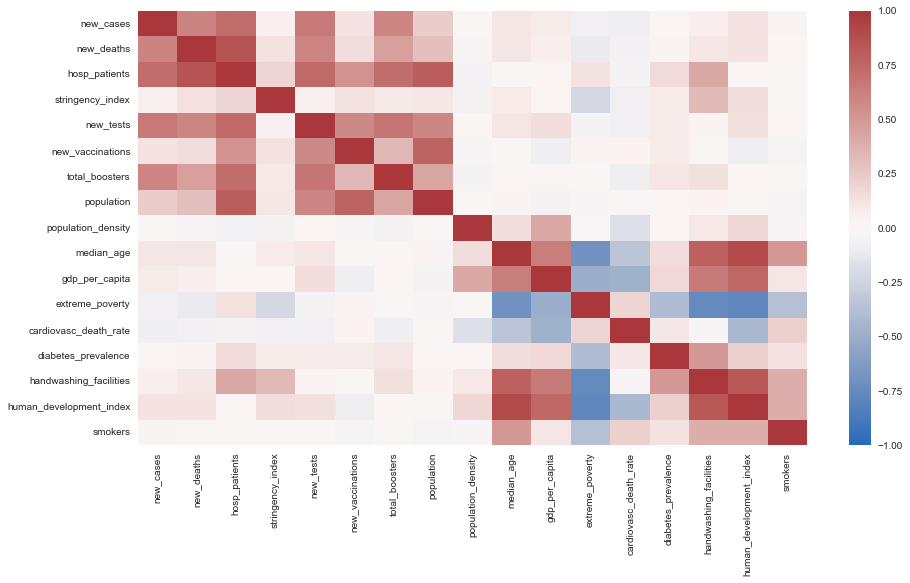
  </p>

* While there was strong correlation between few pairs of attributes, the attributes of interest w.r.t. the narrative which focuses on the no. of new cases per day ("new_cases") and the effects of what countries can do to try to reduce this  ("new_vaccinations", "total_boosters", "handwashing_facilities", "stringency_index", "population") whilst investigating how relative wealth of these countries ("gdp_per_capita") played a part in the same, did not present a compelling pattern when looking at only 2 attributes at a time.
  
  <p align="center" width="100%">
      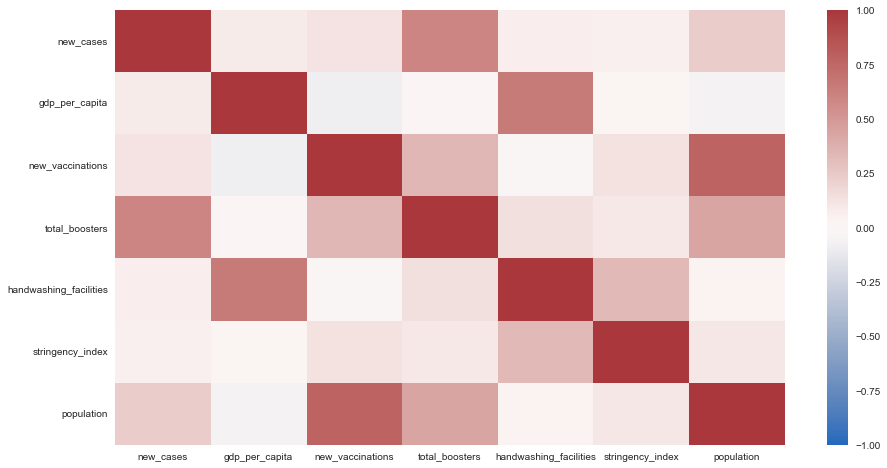
  </p>

* To investigate prospects of clustering, a pair plot was generated between every pair of attributes that were deemed necessary for the narrative.
  
  <p align="center" width="100%">
      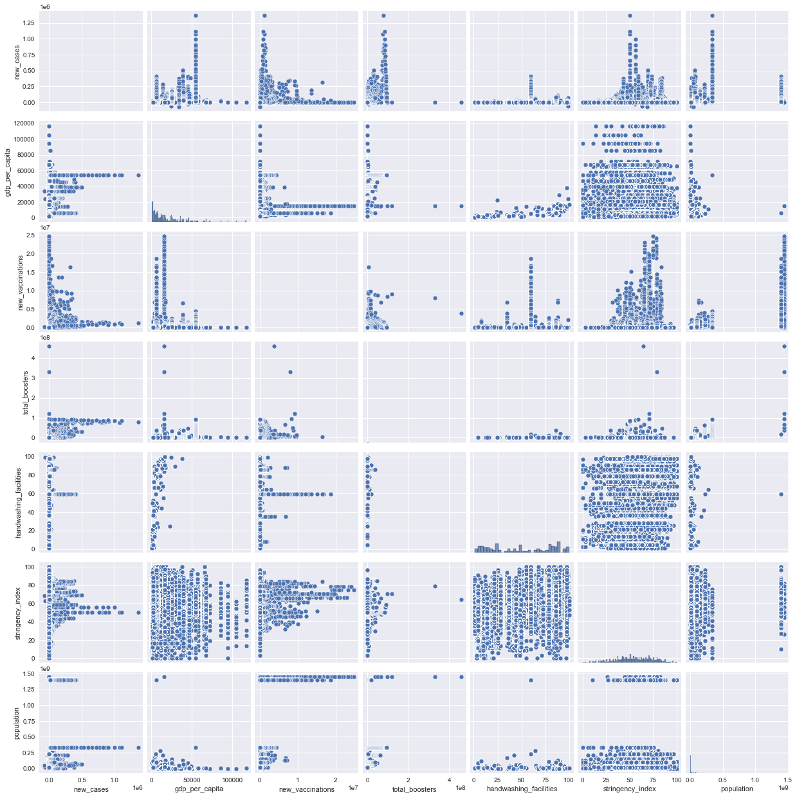
  </p>

* From the pairplot, there seemed to be a relation between "new_cases" and "new_vaccinations", between "new_cases" and "total_boosters" as well as between "gdp_per_capita" and "handwashing_facilities". This is promising suggesting that there is indeed scope for clustering. It is however to be noted that this data review has been performed with data without applying any filters (like country or time), so clusters/trends w.r.t. individual countries, continents or time periods is unknown still and will only be apparent once the dashboard has been built.

The **1.5. Experimental Zone** section was just a place to try out various things like displaying different variables and calculating mean and sum of different variables etc, to see what the resulting values looked like before implementing the same in javascript. These experiments were removed from this file once they were implemented in javascript. Lastly the **1.6. Save Data** section just saves selected attributes as a csv file called "useful_data.csv" which will be loaded into the javascript file.

**Insights Gained**

* EDA conducted led to the insight that attributes required for investigating factors like geographic position, no. of cases and vaccinations given per country/continent over time that can help answer the questions from part 3 of this lab is indeed available in the "Data on COVID-19 (coronavirus) by Our World in Data" dataset. Thus, attributes that shall contribute to data to be displayed on the dashboard were selected to be "location", "continent", "iso_code", "date", "new_cases", "gdp_per_capita", "new_vaccinations", "total_boosters", "handwashing_facilities", "stringency_index", and "population".

* To cluster countries into meaningful clusters, simply considering 2 factors to plot clusters would likely not work in this situation where cases likely depend on multiple other factors such as vaccinations, boosters, handwashing facilities and stringency index of each country which might also in turn depend on the wealth indicated by gdp per capita of the country.  Thus, the decision was made to use an algorithm that can work with high dimensional data that may not be linearly separable adn id in plotting high dimensional data on a 2D plot for cluster analysis. Looking for an algorithm that fulfils these requirements led to the discovery of <font color="orange">t-SNE algorithm</font> that similar to PCA performs dimensionality reduction but additionally also works well with non-linear data. 

* Since different countries have different population, simply comparing attributes such as no. of cases, vaccinations or boosters can be misleading. Instead, the playing field is made more level by dividing values of these attributes by the population in each country (and multiplied by 100 to get value in percentage) to display new case rate, vaccination rate and booster rate instead of just counts.

## 2. Visualization And Code

This section shall go over dashboard visual content and implemented interactions.

#### 2.1. Visuals And Interaction

The dashboard consists of the following 4 main components.

<p align="center" width="100%">
    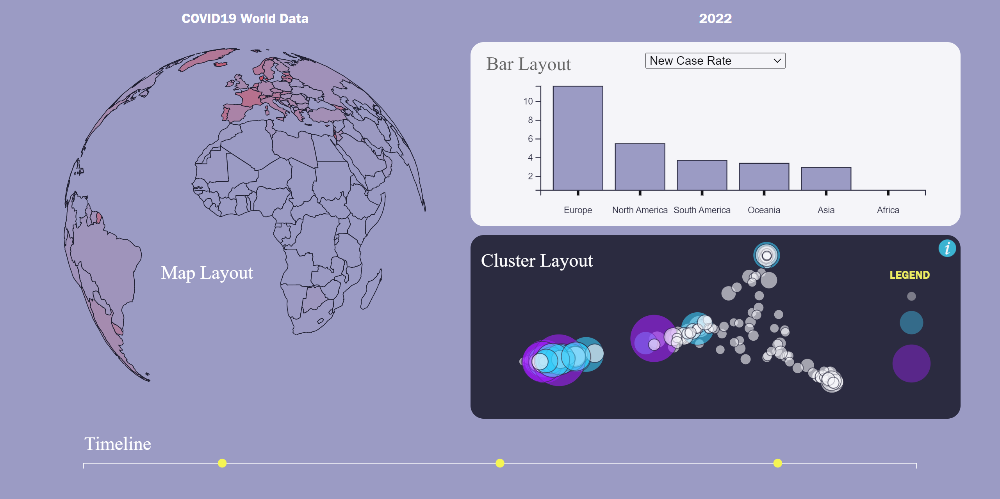
</p>

##### 2.1.1. Timeline

The timeline is a crucial part of the Dashboard as it is what allows for and instantiates filter of data as per time periods. Data may be viewed in terms of years, months or days. However, the most notable results can be seen when viewing data with time in the scale of years since most data is available for comparison at this scale.

Interactions that can be instantiated from the timeline are as shown below.

<p align="center" width="100%">
    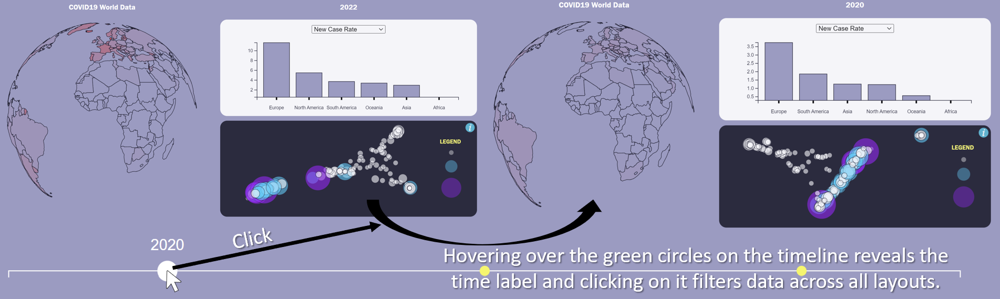
</p>

<p align="center" width="100%">
    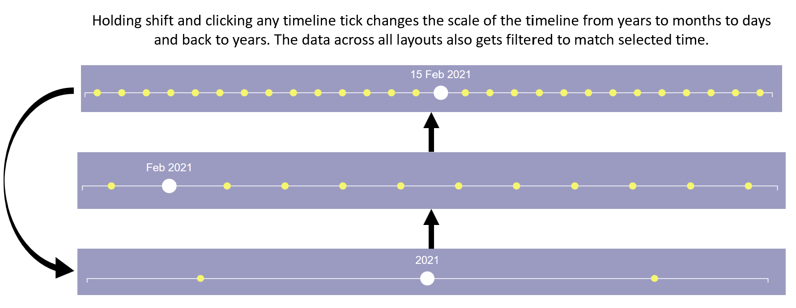
</p>

##### 2.1.2. Map Layout

This layout displays New Case Rate (NCR) associated with each country on a map in the form of an interactive globe where the more red the colour of the country, the higher its NCR value is.

Interactions that can be instantiated from the map layout are as shown below.

<p align="center" width="100%">
    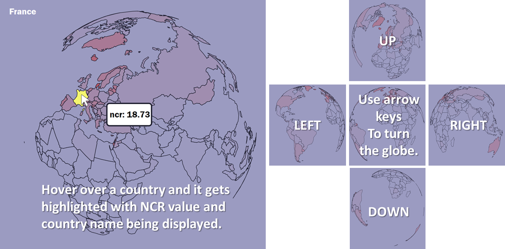
</p>

<p align="center" width="100%">
    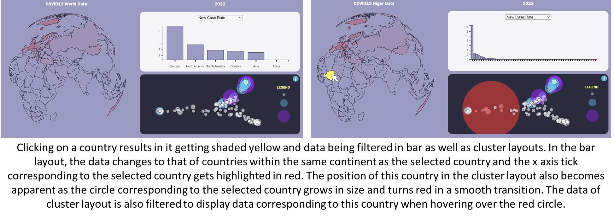
</p>

##### 2.1.3. Bar Layout

This layout allows one to view different parameters such as vaccination rate, booster rate, GDP per capita (measured in constant international dollars), handwashing facilities, stringency index and  population of different countries filtered based on selections made on other layouts in the form of a bar chart. The simple bar chart was chosen as the desired layout for displaying this kind of data for the following reasons. (Barcelona Field Studies Center, 2022)

* A bar chart is among the most effective kind of chart to use to display data such that it's easy to compare. Since it is the goal here to compare performance of different nations w.r.t. effects of their efforts against the spread of covid19, the bar chart was deemed as the best kind of chart to use for clearest interpretability.

* A disadvantage of bar charts is that they can be easily manipulated by manipulating the axes of the chart for selective display of data. This scenario has been avoided here by ensuring that the y-axis scale always begins from 0 and that its max value is slightly larger than the largest value in every set of data with all values clearly marked on the axis such that specific values of each bar is visible upon hovering over each it.

* Another disadvantage of bar charts is that they often fail to make apparent, interdependencies between variables. This issue has been addressed in 2 ways. First, the bar layout has been made such that one can easily toggle between various variables using the dropdown list available. Upon switching from one variable to another, the graph dynamically changes in place to display new information. This can help the viewer see the connections that may exist between various parameters better. Additionally, the cluster layout plots several of the parameters on the same plot making it easier to identify clusters resulting from interactions between the various parameters.

Interactions that can be instantiated from the bar layout are as shown below.

<p align="center" width="100%">
    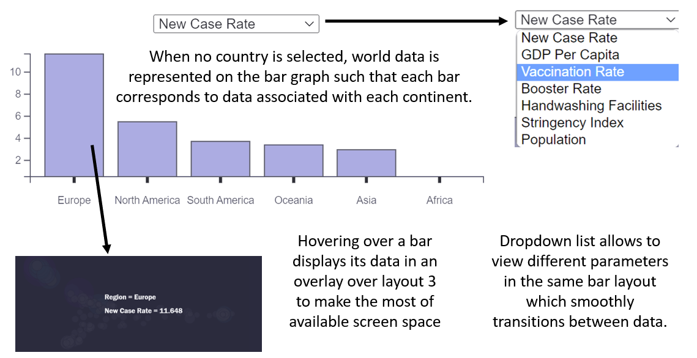
</p>

<p align="center" width="100%">
    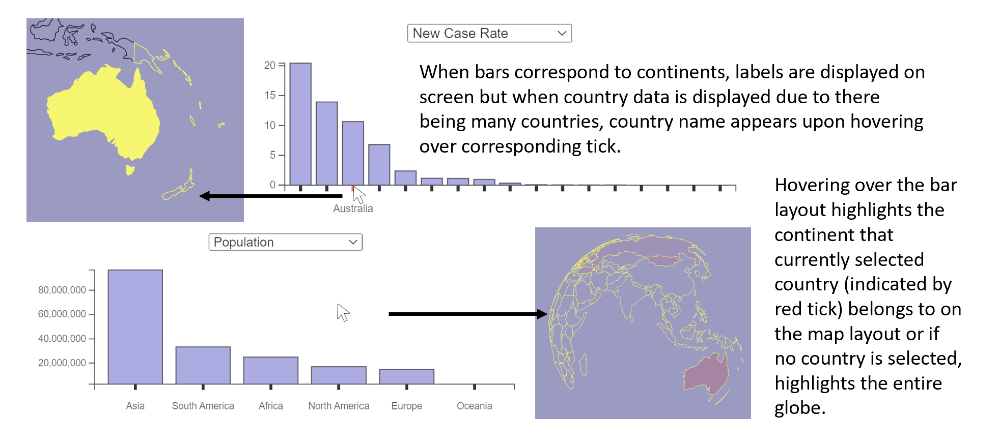
</p>

##### 2.1.4. Cluster Layout

This layout plots four parameters representing available data regarding what countries can do to curb the spread of Covid19. These four factors are "vaccination rate", "booster rate", "stringency index" and "handwashing facilities". This four dimensional input is visualized as two dimensional points using the t-SNE algorithm. Also indicated on the plot is the wealth of the nation in the form of size and colour of circles used to indicate each country. Radius of each circle corresponds to GDP per capita value of corresponding country with wealthier countries being represented using larger circles while less wealthy nations are represented using smaller circles. GDP per capita values was also divided into 3 ranges such that the lower range is represented using white circles, the middle range using blue ones and the higher range using purple circles.  

Interactions that can be instantiated from the bar layout are as shown below.

<p align="center" width="100%">
    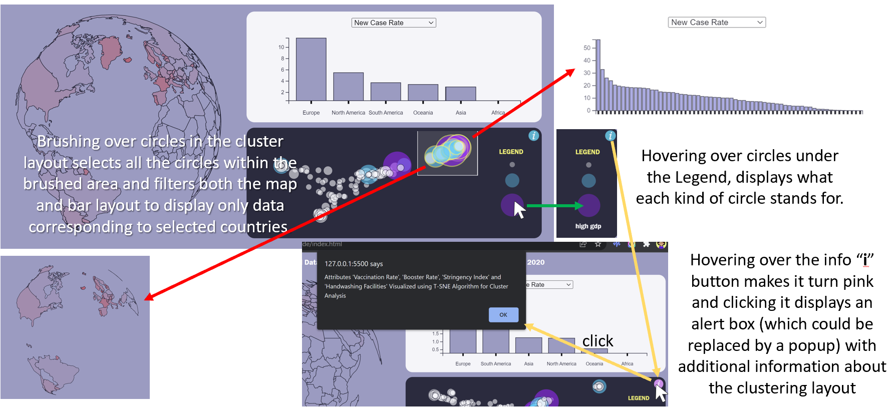
</p>

<p align="center" width="100%">
    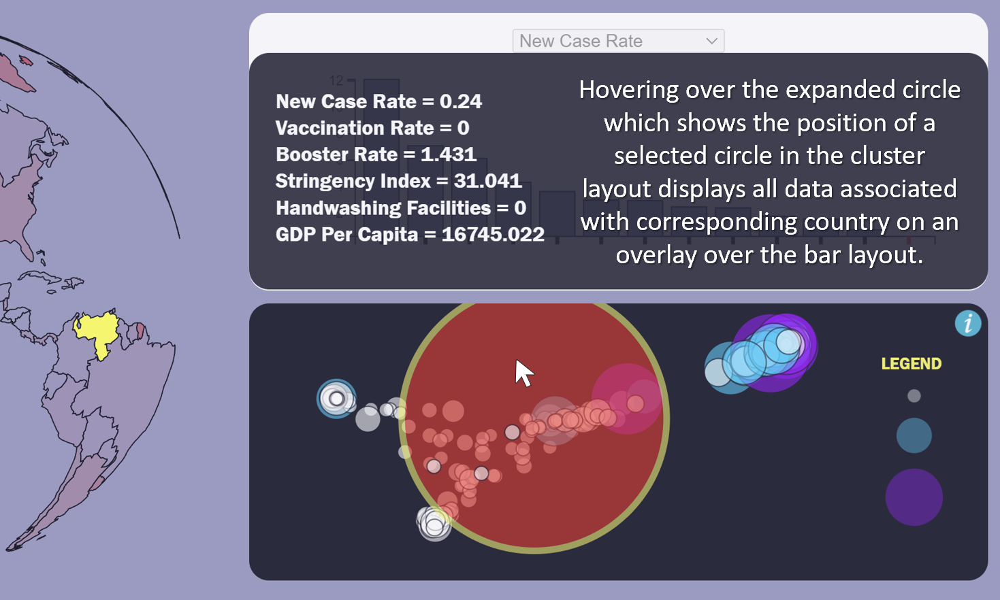
</p>

#### 2.2. HTML And CSS

The html file "index.html" contains just the basic division of the page into its various components.

<u>index.js</u>

```html
<!DOCTYPE html>
<html lang="en">
<head>
    <meta charset="UTF-8">
    <meta http-equiv="X-UA-Compatible" content="IE=edge">
    <meta name="viewport" content="width=device-width, 
            initial-scale=1.0">
    <title>COVID19 Data Dashboard</title>
    <link rel="stylesheet" type="text/css" href="./index.css">
    <script src='https://d3js.org/d3.v7.min.js'></script>
</head>
<body>
    <div class="container">
        <div id="header">COVID19 World Data</div>
        <div id="time_display">Current Data</div>
        <div id="map_layout"></div>
        <div id="bar_layout"></div>
        <div id="cluster_layout"></div>
        <div id="timeline"></div>
        </div>
    </div>
    <script src='./index.js'></script>
    <script src="tsne.js"></script>
</body>
</html>
```

The CSS file contains styles assigned to various elements of the page both which already exist and ones that will be added dynamically using JavaScript and d3.js. The basic structure from above HTML file is arranged in a grid layout using CSS as shown below. Also, the colours as per colour theme of the page is defined using CSS variables.

<u>index.css</u>

```css
:root {
    --color-dark: #1e1e30;
    --color-medium: #9b9bc4;
    --color-light: #ffffff;
    --color-accent: #f5f553;
}

body, html {
    margin: 0;
    padding: 0;
    width: 100vw;
    height: 96vh;
    background-color: var(--color-medium);
    color: var(--color-light);
}

.container {
    width: 100%;
    height: 100%;

    font-family: 'Franklin Gothic Medium', sans-serif;
    font-size: 1em;

    display: grid;
    grid-template-columns: 20% 20% 50%;
    grid-template-rows: 5% 40% 40% 10%;
    justify-content: center;
    gap: 2%;
    padding: 1%;

    box-sizing: border-box;
}

.container div {
    background-color: var(--color-light);
    border-radius: 15px;
}

#header {
    grid-column: span 2;
}

#time_display, #header, #timeline {  
    text-align: center;
    font-size: 100%;
    background-color: var(--color-medium);

}

svg {
    width: 100%;
    height: 100%;
}
...
```

Styles associated with each layout is then defined under sections marked using comments allocated for each kind of layout.

<u>index.css</u> [Timeline]

```css
...
/* TIMELINE */
#timeline {
    grid-column: span 3;
}

.tick circle {
    r: 5;
    fill: var(--color-accent);
    transition: 0.3s;
}

.tick circle:hover {
    r: 10;
    fill: var(--color-light);
}
...
```

<u>index.css</u> [Map Layout]

```css
...
/* MAP */
#map_layout {
    grid-column: span 2;
    grid-row: span 2;
    background-color: var(--color-medium);
}

#map_layout .tooltip rect {
    width: 80px;
    height: 40px;
    rx: 1%;
    fill: var(--color-light);
    stroke: var(--color-dark);
    stroke-width: 0.5%;
}

#map_layout path {
    /* stroke: var(--color-dark); */
    stroke-width: 0.8px;
}

#map_layout path:hover {
    cursor: pointer;
    fill: var(--color-accent);
}
...
```

<u>index.css</u> [Bar Layout]

```css
/* BAR */
#bar_layout {
    padding-top: 2%;
    text-align: center;
    opacity: 0.9;
}

#bar_layout svg {
    height: 90%;
}

#bar_layout .bar:hover {
    stroke: var(--color-accent);
}
```

<u>index.css</u> [Cluster Layout]

```css
/* CLUSTER */
#cluster_layout {
    display: grid;
    grid-template-columns: 80% 20%;
    background-color: var(--color-dark);
    opacity: 0.9;
}

#cluster_layout text {
    font-size: 0.8em;
}

#info_button:hover {
    filter: hue-rotate(90deg);
}
```

#### 2.3. JavaScript And D3.js

The JavaScript file "index.js" that can be found at "./code", contains code that made the dashboard possible. This code has been divided into 7 sections as detailed below.

##### 2.3.1. Utility Function

The JavaScript file begins with declaration of global variables and functions refered to here as utility variables/functions. These variables/functions make available general services/values for any other function in the program to use.

Utility variables include ones that store colours of the colour scheme and ones that store data.

There are 2 utility functions, `fill_series` and `split_range`. 

<u>index.js</u>

```javascript
// UTILITY FUNCTIONS/VARIABLES
/* Utility functions/variables are ones which provide
   general services/values for other functions to use. */

// define color scheme colors
var color_dark = "#1e1e30";
var color_medium = "#9b9bc4";
var color_light = "#ffffff";
var color_accent = "#f5f553";

// define variables that are to store data

// store raw covid dataset
var data_covid = null;

// store raw geojson data
var data_geojson = null;

// store data from selected time period
var data_cur_time = null;

// store variables to be displayed
// which were extracted from the raw dataset
var useful_data = null;

// ranges/extents of every useful variable
var extents = {};

// currently selected country if any
var selected_country = {path:null, code:null};

// map of country codes to countries
var locations_map = new Map();

// map of all continents in
// the dataset to the 
// countries within them
var continents_map = new Map();

// list of years that 
// the data spans
var years = [];

// list of months in a year
const month_names = [
    "Jan", "Feb", "Mar", "Apr",
    "May", "Jun", "Jul", "Aug",
    "Sep", "Oct", "Nov", "Dec"
];

const fill_series = ({start,end,jump }) => {
    /** Returns an array of numbers from "start" to "end" 
     *  with jump as skip interval between two numbers. 
     *  For example, fill_series({start: 0,end: 10,jump: 2}) 
     *  would return [0, 2, 4, 6, 8] */
    range = [];
    for (let i=start; i<end; i+=jump)
        range.push(i);
    return range;
}

const split_range = (start, end, parts) => {
    /** Splits given range of numbers (given the start 
     *  and end of the range) into given no. of equal parts. */
    let result = [],
    delta = (end - start) / (parts - 1);
    while (start < end) {
        result.push(start);
        start += delta;
    }
    result.push(end);
    return result;
}
...
```

##### 2.3.2. Load Data And Create Layouts

Functions `update_useful_data()` and `load()` are the functions that load and pre-process data so that it may be available for display on the dashboard.

The `load()` function performs all necessary actions required to load the data dashboard on screen. The following are steps to be performed before the database can be displayed that the `load()` function does.

1. Read data. 
   
   * The Covid-19 data from https://github.com/owid/covid-19-data/tree/master/public/data after EDA available at "lab3/data/data/useful_data.csv" is loaded. 
   
   * GeoJson data associated with the countries of the world is also loaded from https://raw.githubusercontent.com/holtzy/D3-graph-gallery/master/DATA/world.geojson. 
   
   * Loading of both datasets are encapsulated in a Promise clause that must first be fulfilled before proceeding with subsequent operations that require data to be present. This ensures that data is available before going ahead with operations that use this data.
   2. Determine the years that the data spans. That is determine the time range within which this data was collected in terms of years.
   
   3. Calculate or extract required features from raw data.
   
   4. Determine min and max values (extents) of each extracted numeric feature.
   
   5. Store mapping of countries to their code and of continents to countries for future reference.
   
   6. Filter GeoJson data so that it only contains geographic features associated with countries that are present in the Covid-19 dataset.
   
   7. Create layout objects. Each layout object obtains an update function that can be called to update each layout with latest data. 
   
   8. Create and add a timeline that allows filtering of data by time.

```javascript
...
// LOAD DATA & TIMELINE
...
const load = () => {
    /** Loads data and layouts. */
    Promise.all([
        // load covid-19 data
        d3.csv("../data/useful_data.csv",d3.autoType),
        // load geojson data
        d3.json(
            "https://raw.githubusercontent.com"
            + "/holtzy/D3-graph-gallery/master"
            + "/DATA/world.geojson"
        )
    ]).then(data_loaded => {
        // assign loaded data to appropriate variables
        data_covid = data_loaded[0];
        data_geojson = data_loaded[1];
        data_cur_time = Object.assign([], data_covid);

        // get years that the data spans
        let years_set = new Set();
        data_covid.map(row => years_set.add(
            row.date.getFullYear()
        ));
        years = Array.from(years_set);

        // calculate and assign values that are to 
        // be displayed on the dashboard
        update_useful_data();

        // calculate extent of all numeric variables 
        extents = {
            vaccination_rate: d3.extent(
                useful_data.values(), 
                d => d.vaccination_rate
            ),
            booster_rate: d3.extent(
                useful_data.values(), 
                d => d.booster_rate
            ),
            handwashing_facilities: d3.extent(
                useful_data.values(), 
                d => d.handwashing_facilities
            ),
            new_case_rate: d3.extent(
                useful_data.values(), 
                d => d.new_case_rate
            ),
            stringency_index: d3.extent(
                useful_data.values(), 
                d => d.stringency_index
            ),
            gdp_per_capita: d3.extent(
                useful_data.values(), 
                d => d.gdp_per_capita
            )
        }

        // store mapping countries to their code
        data_covid.forEach(
            row => locations_map.set(
                row.iso_code, { 
                code: row.iso_code,
                location: row.location,
                continent: row.continent
            })
        )

        // map continents to list of countries within
        continents_map = d3.group(
            Array.from(locations_map.values()),
            d=>d.continent
        );
        for (let [k,v] of continents_map) {
            continents_map.set(k,v.map(o=>o.code))
        }

        // filter geojson data so that regions without
        // covid data like say antarctica is not in it
        let valid_locations = Array.from(locations_map.keys())
        data_geojson.features = data_geojson.features.filter(
            f => valid_locations.includes(f.id)
        );

        // load layouts
        map_layout = make_map_layout();
        bar_layout = make_bar_layout();
        cluster_layout = make_cluster_layout();
        make_timeline();
    });
}

load();
...
```

The `update_useful_data()` function called by the `load()` function is the one that extracts/calculates variables that are to be displayed.

```javascript
...
// LOAD DATA & TIMELINE
const update_useful_data = () => {
    /** Rolls up data over time per country and extracts
     *  or calculates data to be visualized. */
    useful_data = d3.rollup(
        [...data_cur_time], 
        row => ({
            // calculate new case rate
            new_case_rate: (
                d3.sum(row,d=>d.new_cases)
                /d3.mean(row,d=>d.population)
            )*100||0,
            // calculate vaccination rate
            vaccination_rate: (
                d3.sum(row,d=>d.new_vaccinations)
                /d3.mean(row,d=>d.population)
            )*100||0,
            // calculate booster rate
            booster_rate: (
                d3.max(row,d=>d.total_boosters)
                /d3.mean(row,d=>d.population)
            )*100||0,
            // calculate average stringency_index
            stringency_index:
                d3.mean(row,d=>d.stringency_index)||0,
            // calculate average handwashing_facilities
            handwashing_facilities:
                d3.mean(row,d=>d.handwashing_facilities)||0,
            // calculate average gdp_per_capita
            gdp_per_capita: 
                d3.mean(row,d=>d.gdp_per_capita)||0,
            // extract continent that this country is a part of
            continent: d3.max(row,d=>d.continent),
            // extract name of this country
            location: d3.max(row,d=>d.location),
            // calculate average population
            population: d3.mean(row,d=>d.population),
            // save iso code of this country
            iso_code: d3.max(row,d=>d.iso_code)
        }),
        row => row.iso_code
    )
}
...
```

##### 2.3.3. Timeline

The `make_timeline()` function creates and adds a timeline to the dashboard with which users can trigger filter of data across the dashboard by specific time periods.

The 1st part of this function simply adds the SVG within which elements of the timeline shall be displayed. The timeline is drawn using `d3.axisBottom()`. The axis and scale of the timeline is also defined in the first part of this function.

<u>index.js</u>

```javascript
...
// TIMELINE
const make_timeline = () => {
    /** Function that adds a timeline. */

    // the timeline can have
    // 3 timescales: 
    //   0 => years (default)
    //   1 => months
    //   2 => days
    let timescale = 0;

    // add timeline svg
    let svg = d3.select("#timeline").append("svg");

    // get width and height of added svg in pixels
    let width_px = svg.style("width").replace("px", "");
    let height_px = svg.style("height").replace("px", "");

    // define axis group and scale
    let axis = svg.append("g")
                  .attr("transform",`translate(${0},${40})`);
    let scale = d3.scaleBand().range([50, width_px-50]);
    ...
}
...
```

Then, a function called `filter_time()` is defined within this function.  This function receives an object with a day, month and year value based on which the data to be displayed on the dashboard (`data_cur_time`)is filtered by date. If any of the year, month or date values are not provided (is null), then the data is not filtered on this time scale.

<u>index.js</u>

```javascript
...
// TIMELINE
const make_timeline = () => {
    ...
    let filter_time = ({day, month, year}) => {
        /** Function that updates data_cur_time 
         *  with data filtered as per given time. */

        let filtered_data = [...data_covid];
        let display_text = "" // time label to display on screen

        // filter by year if given
        if (year != null) {
            filtered_data = filtered_data.filter(
                row => row.date.getFullYear() == year
            );
            display_text = String(year) + display_text;
        }

        // filter by month if given
        if (month != null){
            filtered_data = filtered_data.filter(
                row => row.date.getMonth() == month
            );
            display_text = month_names[month] + " " + display_text;
        }

        // filter by day if given
        if(day != null){
            filtered_data = filtered_data.filter(
                    row => row.date.getDate() == day
            );
            display_text = String(day) + " " + display_text;
        }

        // sort filtered data by date
        filtered_data.sort((a, b) => {
            return d3.ascending(a.date, b.date);
        });

        // update data to be displayed 
        // to be equal to filtered data
        data_cur_time = filtered_data;

        // update time display
        d3.select("#time_display").text(display_text);
    }
    ...
}
...
```

Another function `select_tick()` is defined next. This function receives the label of a tick on the time line which may be consisting of 1 word standing for a year if the timeline has timescale = 0 (years) or it may be consisting of 2 words standing for a month and a year if the timeline has timescale = 1 (months) or it may also consist of 3 words standing for a day, a month and a year if the timeline has timescale = 2 (days). The `select_tick()` function extracts the words in given tick text and if it contains only 1 word then, this means that the timeline is in years scale and thus data onscreen need only be filtered per year for the year thats mentioned in `tick_text`. Similarly, if there are 2 or 3 words in `tick_text`, then data is to be filtered by corresponding month of year or day of month of year respectively. Once the day/month/year by which to filter data is detected, the `filter_time()` function is called with these values as arguments.

<u>index.js</u>

```javascript
...
// TIMELINE
const make_timeline = () => {
    ...
    let select_tick = (tick_text) => {
        /** Function that prompts update of 
         *  data based on given text selection. */

        // get words in given text associated 
        // with currently selected tick
        tick_text = tick_text.split(" ");

        // create a time filter object
        // whose values shall be set later
        time_filter = {year:null, month:null, day:null};

        // if the no. of words in given 
        // tick text is 1, then the timeline 
        // is in year scale 
        if (tick_text.length == 1) {
            time_filter.year = parseInt(tick_text[0]);
        }

        // if the no. of words in given 
        // tick text is 2, then the timeline 
        // is in year scale 
        else if (tick_text.length == 2) {
            time_filter.month = month_names.indexOf(tick_text[0]);
            time_filter.year = parseInt(tick_text[1]);
        }

        // if the no. of words in given 
        // tick text is 3, then the timeline 
        // is in year scale 
        else if (tick_text.length == 3) {
            time_filter.day = parseInt(tick_text[0]);
            time_filter.month = month_names.indexOf(tick_text[1]);
            time_filter.year = parseInt(tick_text[2]);
        }

        // filter time as per time period values
        // derived from currently selected tick text
        filter_time(time_filter);
    }
    ...
}
```

Next, the `shift_scale()` function is defined. This function receives text of currently selected tick as input. Then, based on current `timescale` value, the scale of the timeline is determined. If timescale is currently in years, it is changed to months. If it is in months its changed to days and if its in days, it is changed back to years. Timeline is then updated with new data coresponding to new timescale.

<u>index.js</u>

```javascript
...
// TIMELINE
const make_timeline = () => {
    ...
    let shift_scale = (tick_text) => {
        /** Function that alters timescale and
         *  updates data_cur_time according 
         *  to new scale data. */

        // get oldest and newest  
        // date from current data
        let oldest_date = data_cur_time[0].date;
        let latest_date = data_cur_time.slice(-1)[0].date;

        // if timescale is in years, shift to months
        if (timescale == 0) {
            timescale = 1; 

            // update ticks
            update_ticks(month_names.slice(
                oldest_date.getMonth(),
                latest_date.getMonth()+1
            ).map(month_name => {
                return month_name + " " + tick_text;
            }));

            // select new tick
            tick_text = month_names[
                latest_date.getMonth()
            ] + " " + tick_text;
            select_tick(tick_text);
        }

        // if timescale is in months, shift to days
        else if (timescale == 1){
            timescale = 2;

            // update ticks
            update_ticks(fill_series({
                start: oldest_date.getDate(),
                end: latest_date.getDate()+1,
                jump: 1
            }).map(num => {
                return String(num) + " " + tick_text;
            }));

            // select new tick
            tick_text = String(
                latest_date.getDate()
            ) + " " + tick_text;
            select_tick(tick_text);
        }

        // if timescale is in days, shift to years
        else if (timescale == 2){
            timescale = 0;

            // update ticks
            update_ticks(years);

            // select new tick
            tick_text = String(latest_date.getFullYear())
            select_tick(tick_text);
        }
    }
    ...
}
...
```

The next function defined within the `make_timeine()` function is the `update_ticks()` function. Upon being given a new domain for the timeline axis, the `update_ticks()` function sets the scale of the timeline axis using this new domain and redraws the timeline. The ticks of the timeline that are by default lines, are replaced by circles to which mouseover, mouseout and click event listeners are attatched. Tick text labels are made to be not visible by default (has opacity = 0) because in certain timescales (days/months), there are many ticks on screen and displaying all tick labels all the time will be cumbersome. Instead tick text label corresonding to each tick becomes visible on hover. Clicking a tick, leads to data on screen being filtered as per time period corresponding to selected tick. If shift key was pressed while clicking the tick, then the timescale of the timeline shifts and data gets filtered by latest date on the new timescale.

<u>index.js</u>

```javascript
...
// TIMELINE
const make_timeline = () => {
    ...
    let update_ticks = (domain) => {
        /** Update scale of axis with given domain and
         *  updates ticks to have desired design and interaction. */

        // update scale domain
        scale.domain(domain);
        axis.transition().duration(1000).call(d3.axisBottom(scale));

        // get ticks
        let ticks = svg.selectAll(".tick");

        // add tick text transform
        ticks.selectAll("text")
             .attr("opacity", 0)
             .attr("font-size", "1.5em")
             .attr("transform",`translate(${0},${-40})`);

        // replace tick lines with circles to 
        // which event listeners are attached
        ticks.select("line").remove();
        ticks.append("circle")
             .on("click", (e, d) => {
                let tick = d3.select(e.path[1]);
                select_tick(tick.text());
                if (e.shiftKey == true) {
                   shift_scale(tick.text()); 
                }
            })
             // show tick text on mouseover
             .on("mouseover", (e, d) => {
                 let tick = d3.select(e.path[1]);
                 tick.select("text")
                     .transition().duration(300)
                     .attr("opacity", 1);
             })
             // hide tick text on mouseout
             .on("mouseout", (e, d) => {
                 let tick = d3.select(e.path[1]);
                 tick.select("text")
                     .transition().duration(300)
                     .attr("opacity", 0);
             });
    } 
    ...
}
...
```

The last part of the `make_timeine()` function simply initializes the timeline to display data from the latest year.

<u>index.js</u>

```javascript
...
// TIMELINE
const make_timeline = () => {
    ...
    // initialize timeline scale to be in years
    update_ticks(years);

    // select tick corresponding to the latest
    // year to initialize dashboard to display
    // data from the latest year
    select_tick(String(years.slice(-1)[0]));
}
...
```

##### 2.3.4. Map Layout

A global variable `map_layout` stores a global map layout object that is created by the `make_map_layout()` object factory function. This function returns an object containing an update function which can be called to update the map layout display. 

The first part of the code just adds an SVG wherein to display the map layout and then a color scale that returns red upon being given higest new case rate value and white upon being given lowest new case rate value is created. This is followed by setting up a  geoOrthographic projection and a path generator (using `d3.geoPath()` to which the projection is bound).

<u>index.js</u>

```javascript
...
// MAP LAYOUT
var map_layout = null;
const make_map_layout = () => {
    ...
    /** Makes and adds map layout. */
    let obj = {};

    // currently selected country if any
    let cur_selection = {path:null, code:null}

    let svg = d3.select("#map_layout")
                .attr("background-color", "#8b87d5")
                .append("svg");
    let width_px = svg.style("width").replace("px", "");
    let height_px = svg.style("height").replace("px", "");

    // color scale
    let color_scale = d3.scaleLinear()
                        .domain(extents.new_case_rate)
                        .range([color_medium, "red"])
                        .interpolate(d3.interpolateRgb);

    // path generator and projection
    let yaw = 0;
    let pitch = 0;
    let projection = d3.geoOrthographic()
                       .scale((width_px/Math.PI)*1.4)
                       .center([0, 0])
                       .translate([width_px/2,height_px/2])
                       .rotate([yaw, pitch, 0]);
    let geo_generator = d3.geoPath().projection(projection);
    ...
}
...
```

The next part of the code creates the tooltip label that appears with new case rate (NCR) indicated on it while hovering over a country on the map.

<u>index.js</u>

```javascript
...
// MAP LAYOUT
var map_layout = null;
const make_map_layout = () => {
    ...
    // tooltip
    let tooltip = svg.append("g")
                     .attr("class", "tooltip")
                     .attr("opacity", 0);
    tooltip.append("rect");
    let tooltip_data_label = tooltip.append("text")
                                    .text("cr")
                                    .attr("x", 0)
                                    .attr("y", 40);
    let tooltip_country_label = tooltip.append("text")
                                       .attr("x", 0)
                                       .attr("y", 12)
                                       .attr("fill", color_light)
                                       .text("country");
    ...
}
...
```

The next section of the `make_map_layout()` function draws the paths corresponding to each country as per geo json data.  Event listeners are attatched to these paths such that hovering over them displays the tooltip label with the NCR rate and also displays the name of the country in addition to highlighing the country in yellow. Effects of onmouseover are reversed on mouseout. If a country is clicked on the map, it is highlighted in yellow and the position of this country is made apparent in the cluster layout. Morever, the bar layout data gets filtered to display only data related to countries that fall within the same continent as the selected country.

<u>index.js</u>

```javascript
...
// MAP LAYOUT
var map_layout = null;
const make_map_layout = () => {
    ...
    // add paths to be drawn
    let paths = svg.append("g")
                   .selectAll("path")
                   .data(data_geojson.features)
                   .join("path")
                   .attr("id",d=>`path_${d.id}`)
                   .attr("fill", color_light)
                   .attr("stroke", color_dark);

    // append event listeners to paths
    paths.on("mouseover", (e, d) => {
            // highlight country and show tooltip
            let iso_code = d.id;
            let country_data = useful_data.get(iso_code);
            let ncr = 0;
            if (country_data) {ncr = Math.round(
                country_data.new_case_rate*100
            )/100}
            tooltip.select("rect")
                   .attr("x", e.x-5)
                   .attr("y", e.y-25);
            tooltip_data_label.attr("x", e.x)
                              .attr("y", e.y)
                              .text(`ncr: ${ncr}`);
            tooltip_country_label.text(d.properties.name);
            tooltip.transition().duration(500)
                   .attr("opacity", 1);
        })
        .on("mouseout", (e, d) => {
            // hide tooltip 
            tooltip.transition()
            .duration(100)
            .attr("opacity", 0);
        })
        .on("click", (e, d) => {
            let path = d3.select(e.srcElement);
            let iso_code = d.id;
            let name = d.properties.name;
            let country_data = null;
            let prev_selection = {};
            Object.assign(prev_selection, selected_country);
            cur_selection = {path: path, code: iso_code}

            // unselect previously selected country id any
            selected_country.path = null;
            selected_country.code = null;
            country_data = useful_data.get(prev_selection.code);
            country_data && prev_selection.path.attr(
                "fill", color_scale(country_data.new_case_rate)
            );
            d3.select("#header").text("COVID19 World Data")

            // if this country is not the same as the previously
            // selected country, select it
            if (cur_selection.code != prev_selection.code
                && useful_data.get(cur_selection.code)
            ){
                selected_country.path = cur_selection.path;
                selected_country.code = cur_selection.code;
                path.attr("fill", color_accent);
                d3.select("#header").text(`COVID19 ${name} Data`);
            } else {cur_selection = {path: null, code: null}}

            // update bar layout data and cluster layout data
            bar_layout.update();
            cluster_layout.focus_country();
        });

    // bring tooltip to front
    tooltip.raise();

    let draw_paths = () => {
        /** Draws each country. */
        paths.attr("d", geo_generator);
    }

    draw_paths();
    ...
}
...
```

The next part makes the rotation interaction of the globe using arrow keys possible.

<u>index.js</u>

```javascript
...
// MAP LAYOUT
var map_layout = null;
const make_map_layout = () => {
    ...
    // globe rotation
    // here window.requestAnimationFrame() is used so that the 
    // window refreshes after each frame movement is complete to
    // avoid the movement looking glitchy
    d3.select("body").on("keydown", (e, d) => {
        // right arrow pressed then rotate to right
        if(e.keyCode == 39){
            yaw -= 10;
            projection.rotate([yaw,pitch,0])
            window.requestAnimationFrame(draw_paths);
        }
        // left arrow pressed then rotate to left
        else if(e.keyCode == 37){
            yaw += 10;
            projection.rotate([yaw,pitch,0])
            window.requestAnimationFrame(draw_paths);
        }
        // up arrow pressed then rotate up
        else if(e.keyCode == 38){
            pitch += 10;
            projection.rotate([yaw,pitch,0])
            window.requestAnimationFrame(draw_paths);
        }
        // down arrow pressed then rotate down
        else if(e.keyCode == 40){
            pitch -= 10;
            projection.rotate([yaw,pitch,0])
            window.requestAnimationFrame(draw_paths);
        }
    });      
    ...
}
...
```

The final function defined within the `make_map_layout()` function is the `update()` function which is part of the `obj` map layout object returned by this object factory function used to update content of the map layout.

<u>index.js</u>

```javascript
...
// MAP LAYOUT
var map_layout = null;
const make_map_layout = () => {
    ...   
    obj.update = () => {
        /** Updates Map */

        // change fill color of paths based on
        // latest NCR value of each country
        paths.transition().duration(1000)
             .attr("fill", d => {
                let country_data = useful_data.get(d.id);
                if (country_data) { 
                    return color_scale(
                        country_data.new_case_rate
                    );
                } else return color_medium;
             });

        // if a current selection exists, then dont't
        // change its color, leave it highlighted in
        // yellow until it is clicked again which selects it
        if (cur_selection.code != null){
            let sel_path = d3.select(`#path_${cur_selection.code}`);
            if (sel_path) { 
                sel_path.transition().duration(1000)
                        .attr("fill",color_accent);
            }
        }
    }
    return obj;
}
...
```

##### 2.3.5. Bar Layout

A global variable `bar_layout` stores a global bar layout object that is created by the `make_bar_layout()` object factory function. This function returns an object containing an update function which can be called to update the bar layout display.

The first part of the code adds the dropdown list that will be a part of this layout and sets its possible options as well as default option.

```javascript
...
// BAR LAYOUT
var bar_layout = null;
const make_bar_layout = () => {
    /** Adds bar chart. */
    let obj = {}; 

    // add dropdown list
    let dropdown = d3.select("#bar_layout")
                     .append("g")
                     .attr("id", "blg1")
                     .append("select")
                     .attr("name", "features");

    // store features that are to be options in the 
    // dropdown list as a map. Each option has form 
    // [variable_name, Display Name]
    let options = [
        ["new_case_rate", "New Case Rate"],
        ["gdp_per_capita", "GDP Per Capita"],
        ["vaccination_rate", "Vaccination Rate"],
        ["booster_rate", "Booster Rate"],
        ["handwashing_facilities", "Handwashing Facilities"],
        ["stringency_index", "Stringency Index"],
        ["population", "Population"]
    ]

    let cur_option = ["new_case_rate", "New Case Rate"];

    dropdown.selectAll("option")
            .data(options)
            .join("option")
            .attr("name", d=>d[1])
            .attr("value", d=>d[0])
            .text(d=>d[1]);
    ...
}
...
```

The next part of the code just adds an SVG wherein to display the bar layout to which a hover interaction is added. using the on mouseover and on ouseout event listeners. The margin of the SVG is also defined. This is followed by defining of the ordinal x axis and the numeric y axis. Also added is a display called `ttg` which is a rect overlayed on this layout's SVG to be used by the cluster layout as a display.

<u>index.js</u>

```javascript
...
// BAR LAYOUT
var bar_layout = null;
const make_bar_layout = () => {
    ...
    // add svg
    let svg = d3.select("#bar_layout").append("svg");

    // get dimensions of svg in pixels
    let width_px = Number(svg.style("width").replace("px",""));
    let height_px = Number(svg.style("height").replace("px",""));

    let margin = {
        left: 80, right: 40,
        top: 20, bottom: 40 
    };

    // add hover interaction of svg
    let hover_countries = [];
    d3.select("#bar_layout")
    // on mouse over highlight the continent
    // of selected country/ the hle globe 
    // in the map layout
    .on("mouseover", (e,d) => {
        // assume world to be highlighted by default
        // which would be the case if 
        // selected_country == null
        let region = "world"; 
        if (selected_country.path != null) {
            region = locations_map.get(
                selected_country.code
            ).continent;
        }
        if (region == "world") {
            Array.from(
                continents_map.values()
            ).map(arr => hover_countries.push(...arr));
        } else {
            // if a selected country exists,
            // then highlight only countries
            // that fall within the same continent as it
            hover_countries = continents_map.get(region);
        }
        hover_countries.forEach(code => {
            let path = d3.select(`#path_${code}`);
            path && path.attr("stroke", color_accent);
        })
    }).on("mouseout", (e,d) => {
        // set stroke color of all highlighted
        // parts of the map layout back to 
        // default color
        if (hover_countries) {
            hover_countries.forEach(code => {
                let path = d3.select(`#path_${code}`);
                path && path.attr("stroke",color_dark);
            })
            hover_countries = [];
        }
    });

    // add axes, define their scales
    let x_scale = d3.scaleBand()
        .range([margin.left, width_px-margin.right])
        .padding(0.2);
    let x_axis = svg.append("g")
        .attr("color", color_dark)
        .attr("transform",`translate(${0},${height_px-margin.bottom})`);
    let y_scale = d3
        .scaleLinear()
        .range([height_px-margin.bottom, margin.top]);
    let y_axis = svg.append("g")
        .attr("color", color_dark)
        .attr("transform",`translate(${margin.left}, ${0})`)
        .call(d3.axisLeft(y_scale));

    // tooltip (display) for cluster layout to use
    let ttg = svg.append("g")
                 .attr("class", "tooltip");
    ttg.append("rect")
       .attr("fill", color_dark)
       .attr("width", width_px)
       .attr("height", height_px)
       .attr("rx", 15)
       .attr("opacity", 0);
    // take this display back so that its
    // not visible until cluster layout needs it
    ttg.lower();
    ...
}
...
```

Then, a function called `filter_region()`is defined within the `make_bar_layout()` function which filters bar layout data based on currently selected country if a country is selected or otherwise displays continent wise data.

<u>index.js</u>

```javascript
...
// BAR LAYOUT
var bar_layout = null;
const make_bar_layout = () => {
    ...
    let filter_region = () => {
        /** Filters out data by region. */

        // if no country is selected
        // then display data per continent
        if (selected_country.path == null) {
            data = Array.from(d3.rollup(
                [...useful_data.values()],
                row => ({
                    vaccination_rate: 
                        d3.mean(row, d=>d.vaccination_rate),
                    booster_rate: 
                        d3.mean(row, d=>d.booster_rate),
                    handwashing_facilities: 
                        d3.mean(row, d=>d.handwashing_facilities),
                    stringency_index: 
                        d3.mean(row, d=>d.stringency_index),
                    new_case_rate: 
                        d3.mean(row, d=>d.new_case_rate),
                    gdp_per_capita: 
                        d3.mean(row, d=>d.gdp_per_capita),
                    population: 
                        d3.mean(row, d=>d.population),
                    group: 
                        d3.max(row, d=>d.continent)
                }),
                row => row.continent
            ).values());
        } 

        // if a country is selected then display 
        // data of countries in the same continent
        // as the selected country
        else { 
            let continent = locations_map.get(
                selected_country.code
            ).continent;
            data = [];
            for (const obj of Array.from(
                useful_data.values()
            )) {
                if (obj.continent == continent) {
                    data.push({
                        vaccination_rate: 
                            obj.vaccination_rate,
                        booster_rate: 
                            obj.booster_rate,
                        handwashing_facilities: 
                            obj.handwashing_facilities,
                        stringency_index: 
                            obj.stringency_index,
                        new_case_rate: 
                            obj.new_case_rate,
                        gdp_per_capita:
                            obj.gdp_per_capita,
                        population:
                            obj.population,
                        group: obj.location
                    })
                }
            }
        }
    }
    ...
}
...
```

The next function defined, `update_axes()` updates the x and y axis of the bar chart with values as per current data. The x axis values are always sorted in decreasing order.

<u>index.js</u>

```javascript
...
// BAR LAYOUT
var bar_layout = null;
const make_bar_layout = () => {
    ...
    let update_axes = () => {
        /** Updates axes. */

        // update x axis
        data.sort((a, b) => d3.descending(
            a[cur_option[0]],b[cur_option[0]]
        ));
        let x_domain = data.map(obj => obj.group);
        x_scale.domain(x_domain);
        x_axis.transition().duration(1000)
              .call(d3.axisBottom(x_scale));

        // set color of tick line of selected country to red
        x_axis.selectAll("line")
              .attr("stroke-width", 3)
              .attr("stroke", d => {
                    let stroke_color = "black";
                    let code = selected_country.code;
                    if (code) {
                        let loc = locations_map.get(code).location;
                        if (d == loc) stroke_color = "red";
                    }
                    return stroke_color;
              });

        // display tick labels only if continents are
        // displayed since there are fewer continents.
        // else, show label of a tick only upon 
        // hovering over that tick
        if (data_received == false 
            && selected_country.path == null
        ){
            x_axis.selectAll("text")
                  .transition()
                  .duration(1000)
                  .attr("opacity", 1)
                  .attr("transform","translate(0,10)")
        } else {
            x_axis.selectAll("text")
                  .transition()
                  .duration(100)
                  .attr("opacity", 0)
                  .attr("transform","translate(0,10)")
        }

        // make label appear upon hovering over
        // tick line on x-axis
        x_axis.selectAll(".tick").select("line")
        .on("mouseover", (e,d) => {
            let tick = d3.select(e.path[1]);
            tick.select("text").attr("opacity", 1)
        }).on("mouseout", (e,d) => {
            if (!continents_map.get(d)) {
                let tick = d3.select(e.path[1]);
                tick.select("text").attr("opacity", 0);
            }
        });

        // update y axis
        let y_domain = d3.extent(
            Array.from(data.values())
            .map(obj => obj[cur_option[0]])
        );
        y_scale.domain(y_domain);
        y_axis.transition().duration(1000)
              .call(d3.axisLeft(y_scale).ticks(5));
    }
    ...
}
...
```

The following 2 functions `show_label()` and `hide_label()` shows and hides an overlay over the cluster layout used to display current data of a selected bar in the bar layout.

<u>index.js</u>

```javascript
...
// BAR LAYOUT
var bar_layout = null;
const make_bar_layout = () => {
    ...
    let show_label = (d) => {
        /** Makes overlay over the cluster layout
         *  visible with given data displayed on it. */
        let tooltip = d3.select("#cluster_layout").select(".tooltip");
        let tt_rect = tooltip.select("rect");
        tt_rect.transition().duration(1000).attr("opacity", 0.95);
        tooltip.selectAll("text").data([
                ["Region", d.group],
                [cur_option[1], Math.round(d[cur_option[0]]*1000)/1000]
            ])
            .join("text").attr("fill", color_light)
            .text(d => `${d[0]} = ${d[1]}`)
            .attr("transform", (d,i) => 
                `translate(${width_px/3},${height_px/2+(i*25)})`
            ).transition().duration(1000).attr("opacity", 1);
        tooltip.raise(); // bring overlay to the front
    }

    let hide_label = () => {
        /** Makes overlay over the cluster layout disappear. */
        let tooltip = d3.select("#cluster_layout").select(".tooltip");
        let tt_rect = tooltip.select("rect");

        // make tooltip disappear
        tooltip.selectAll("text")
               .transition().duration(1000)
               .attr("opacity", 0);
        tt_rect.transition().duration(1000).attr("opacity", 0);
        tooltip.lower(); // take overlay to the back
    }
    ...
}
...
```

Next defined within he `make_bar_layout()` function is the `update_bars()` function which apends, updates or removes bars on the bar graph as per current data and selected drop down option. Following this function, this layout's `update()` function that is returned as part of the `obj` function is defined. A `data` variable stores latest data displayed on this layout and a `data_received` flag is set if the data displayed resulted from default filtering (data_received = false) or if specific countries to be displayed has been provided to the update function (data_received = true).

<u>index.js</u>

```javascript
...
// BAR LAYOUT
var bar_layout = null;
const make_bar_layout = () => {
    ...
    let update_bars = () => {
        /** Updates bars of the graph */
        let bars = svg.selectAll(".bar").data(data);
        bars.enter()
            .append("rect").attr("class", "bar")
            .on("mouseover", (e,d) => show_label(d))
            .on("mouseout", hide_label)
            .merge(bars).transition()
            .duration(1000).attr("opacity", 1)
            .attr("x", d => { console.log(d); return x_scale(d.group)})
            .attr("y", d => y_scale(d[cur_option[0]]))
            .attr("width", x_scale.bandwidth())
            .attr("height", d => 
                height_px-y_scale(d[cur_option[0]])-margin.bottom
            )
            .attr("stroke-width", 1)
            .attr("stroke", color_dark)
            .attr("fill", color_medium)
        bars.exit()
            .transition()
            .duration(1000)
            .attr("opacity",0)
            .attr("height",0)
            .attr("width",0)
            .remove();
    }

    let data = null;
    let data_received = false;
    let update = (filtered_data) => {
        // if specific countries whose data to 
        // display has been provided as 
        // filtered_data, then display this data
        // and set data_received flag to true
        if (filtered_data) {
            data_received = true;
            data = filtered_data;
        }
        // else follow protocol and display either
        // data grouped by continent or by 
        // nations within a continent
        else {
            data_received = false;
            filter_region()
        };

        // update axes and bars as per latest set data
        update_axes();
        update_bars();
    }
    ...
}
...
```

Finally an on change event listener is added to the dropdown list object so that the bars on the bar layout get suiabley updated everytime a new option is selected. After this the `update()` function is bound to the object and returned.

<u>index.js</u>

```javascript
...
// BAR LAYOUT
var bar_layout = null;
const make_bar_layout = () => {
    ...
    // filter data on bar layout
    // accordingly every time a new
    // dropdown option is selected
    dropdown.on("change", (e, d) => {
        // get chosen option
        let src_elem = d3.select(e.srcElement);
        let val = src_elem.property("value");
        // get display name of the selected 
        // option from its variable name
        let name = val.split("_");
        name = name.map(n => 
            n.charAt(0).toUpperCase() + n.slice(1)
        )
        name = name.join(" ")

        // set option as currently selected option
        cur_option = [val, name];

        // update data on bar layout
        if (data_received) update(data);
        else update();
    });

    obj.update = update;

    return obj;
}
...
```

##### 2.3.6. Cluster Layout

Just like for all the otehr layouts, for this one as well, A global variable `cluster_layout` stores a global clusterlayout object that is created by the `make_cluster_layout()` object factory function. This function returns an object containing an update function which can be called to update the bar cluster layout display.

The first part of the code adds the SVG within which to display the cluster layout and defines the x and y axes. The color and radius scale (dependent on `gdp_per_capita` values) as per which the color and radius of each point in the cluster layout is set, is defined. This is followed by creating an overlay over this layout that the bar layout may use to display data.

<u>index.js</u>

```javascript
...
// CLUSTER LAYOUT
var cluster_layout = null;
const make_cluster_layout = () => {
    let obj = {};

    // add svg
    let svg = d3.select("#cluster_layout").append("svg");

    // get dimensions of svg in pixels
    let width_px = Number(svg.style("width").replace("px", ""));
    let height_px = Number(svg.style("height").replace("px", ""));

    let margin = {left:60, right:30, top:20, bottom:40};

    // add axes
    let x_scale = d3.scaleLinear()
        .range([margin.left, width_px-margin.right]);

    let y_scale = d3
        .scaleLinear()
        .range([height_px-margin.bottom, margin.top]);

    // color and radius scale
    let gdp_range = split_range(
        extents.gdp_per_capita[0],
        extents.gdp_per_capita[1],
        4
    );

    let color_scale = (gdp_pc) => {
        if (gdp_pc > gdp_range[2]) return "#9d00ff";
        else if (gdp_pc > gdp_range[1]) return "#00d0ff";
        else return "#ffffff";
    }

    let radius_scale = d3.scaleLinear()
                         .domain(extents.gdp_per_capita)
                         .range([5,30]); 
    // create display for bar layout to use
    let ttg = svg.append("g")
                 .attr("class", "tooltip");
    ttg.append("rect")
       .attr("fill", color_dark)
       .attr("width", width_px)
       .attr("height", height_px)
       .attr("opacity", 0);
    ttg.lower(); // send to back
    ...
}
...
```

The next part of the code uses an implementation of the t-SNE algorithm obtained from (Karpathy, Piotrgrudzien, 2016), a demo of which was discovered at (Stanford, no date), to visulize 4 parameters `vaccination_rate`, `booster_rate`, `handwashing_facilities` and `stringency_index`. There are 2 functions that make the use of the t-SNE implementation that can be found at "lab3/code/tsne.js" work with this project. They are `get_data_for_tsne()` and `run_tsne()`.  The `run_tsne()` function also updates data of the `cluster_layout`.

<u>index.js</u>

```javascript
...
// CLUSTER LAYOUT
var cluster_layout = null;
const make_cluster_layout = () => {
    ...
    let get_data_for_tsne = () => {
        /** Updates data to be in a format suited for t-sne
         *  algorithm implementation used here. */
        X = Array.from(
            useful_data.values()
        ).map(r => {
            // give 4 variables indicating  
            // national efforts to reduce spread of 
            // covid as input to the t-SNE algorithm
            return [
                r.vaccination_rate,
                r.booster_rate,
                r.handwashing_facilities,
                r.stringency_index
            ]
        });
        return X;
    }

    let run_tsne = ({n, X}) => {
        /** Runs t-SNE algorithm with given
         *  data X for n iterations. */

        // create a t-sne instance
        let tsne = new tsnejs.tSNE(opt);

        // initialize tsne
        tsne.initDataRaw(X);

        // run for n iterations
        for(let i=0; i<n; i++) {tsne.step();}
        let tsne_points = tsne.getSolution();
        let values = Array.from(useful_data.values());

        // update data
        data = [];
        for (let i=0; i<values.length; i++){
            let v = values[i];
            data.push({
                code: v.iso_code,
                location: v.location,
                gdp_per_capita: v.gdp_per_capita,
                point: tsne_points[i],
                stringency_index: v.stringency_index,
                handwashing_facilities:v.handwashing_facilities,
                vaccination_rate: v.vaccination_rate,
                booster_rate: v.booster_rate,
                continent: v.continent,
                population: v.population,
                new_case_rate: v.new_case_rate
            });
        }
    }
    ...
}
...
```

The next 2 functions, `update_axes()` and `plot_points` defined within the `make_cluster_layout()` function updates the scale of the x and y axis (which is not displayed as the scale is not meaningful to humans since it is simply the x, y coordinates of points used to visualize perviously mentioned 4 variables as output by t-SNE algorithm after dimensionality reduction) and plots points output by t-SNE algorithm on the cluster layout.

<u>index.js</u>

```javascript
...
// CLUSTER LAYOUT
var cluster_layout = null;
const make_cluster_layout = () => {
    ...
    let update_axes = () => {
        /** Updates axes based
         *  on latest data. */
        let x_extent = d3.extent(data.map(d=>d.point[0]));
        let y_extent = d3.extent(data.map(d=>d.point[1]));
        x_scale.domain(x_extent);
        y_scale.domain(y_extent);
    }

    let plot_points = () => {
        /** Plots points received upon running tsne */
        // add circles using points output by t-SNE algorithm
        // upon being given vaccination_Rate, booster_rate
        // handwashing_facilities and stringency_index as input
        let points = svg.selectAll("circle").data(data);
        points.enter().append("circle")
            .merge(points)
            .attr("id", d => `point_${d.code}`)
            .transition().duration(1000)
            .attr("opacity", 0.6)
            .attr("cx", d => x_scale(d.point[0]))
            .attr("cy", d => y_scale(d.point[1]))
            // set radius and color based on gdp_per_capita
            .attr("r", d => radius_scale(d.gdp_per_capita))
            .attr("fill", d => color_scale(d.gdp_per_capita))
            .attr("stroke", color_dark);
        points.exit().transition().duration(1000)
              .attr("r", 0).remove();
    }
    ...
}
...
```

The next 2 functions display data associated with an emphasized circle on the layout when hoveing over it. The `show_labels()` function displays circle data on the overlay in the bar layout and `hide_labels()` hides it.

<u>index.js</u>

```javascript
...
// CLUSTER LAYOUT
var cluster_layout = null;
const make_cluster_layout = () => {
    ...
    let show_labels = (c, d) => {
        /** Displays data (d) associated with
         *  current highlighted circle (c) on the 
         *  cluster layout using an overlay 
         *  over the bar layout. */

        // remove dropdown
        d3.select("#bar_layout")
          .select("select")
          .attr("disabled", true);

        // highlight circle 
        c.attr("stroke-width", 5)
         .attr("stroke", color_accent);

        // display text
        let tooltip = d3.select("#bar_layout")
                        .select(".tooltip");

        // get overlay from bar layout 
        // in which to display data
        let tt_rect = tooltip.select("rect");
        tt_rect.transition().duration(1000)
               .attr("opacity", 0.9);

        // bind data to display
        tooltip.selectAll("text")
        .data([
            ["New Case Rate", Math.round(
                d.new_case_rate
            *1000)/1000],
            ["Vaccination Rate", Math.round(
                d.vaccination_rate
            *1000)/1000],
            ["Booster Rate", Math.round(
                d.booster_rate
            *1000)/1000],
            ["Stringency Index", Math.round(
                d.stringency_index
            *1000)/1000],
            ["Handwashing Facilities", Math.round(
                d.handwashing_facilities
            *1000)/1000],
            ["GDP Per Capita", Math.round(
                d.gdp_per_capita
            *1000)/1000]
        ])
        // display data as text on overlay
        .join("text")
        .attr("fill", color_light)
        .text(d => `${d[0]} = ${d[1]}`)
        .transition()
        .duration(1000)
        .attr("opacity", 1)
        .attr("transform", (d,i) => 
            `translate(${20},${height_px/5+(i*20)})`
        );

        // bring tooltip to front
        tooltip.raise();
    }

    let hide_labels = (c, d) => {
        /** Hides values. */

        // set highlighted circle back to normal
        c.attr("stroke-width", 1)
         .attr("stroke", color_dark);

        // enable dropdown
        d3.select("#bar_layout")
          .select("select")
          .attr("disabled", null);

        // make tooltip disappear
        let tooltip = d3.select("#bar_layout")
                        .select(".tooltip");

        let tt_rect = tooltip.select("rect");

        tooltip.selectAll("text")
               .transition()
               .duration(1000)
               .attr("opacity", 0)
               .attr("transform", `translate(${0},${0})`);

        tt_rect.transition()
               .duration(1000)
               .attr("opacity", 0);

        tooltip.lower();
    }
    ...
}
...
```

Next up is a `focus_country()` function which is attached to the `obj` object such that it can be called by the map layout to highlight a circle associated with a selected country on the map. 

<u>index.js</u>

```javascript
...
// CLUSTER LAYOUT
var cluster_layout = null;
const make_cluster_layout = () => {
    ...
    obj.focus_country = () => {
        /** Focuses on currently selected country. */

        // set all selected back to normal
        // in case any one was already highlighted
        let circles = svg.selectAll("circle");
        circles.on('mouseover', null).on("mouseout", null);
        circles.data(data).transition().duration(1000)
            .attr("fill", d => color_scale(d.gdp_per_capita))
            .attr("r", d => radius_scale(d.gdp_per_capita));

        if (
            selected_country.code
            && useful_data.get(selected_country.code)
        ) {
            // highlight circle
            let c = svg.select("#point_"+
                selected_country.code 
            );

            c.on("mouseover", (e,d) => {
                show_labels(c, d);
            }).on("mouseout", (e,d) => {
                hide_labels(c, d);
            });

            // highlight circle
            c.transition()
                .duration(1000)
                .attr("r", 100)
                .attr("fill", "red");
        }
    }
    ...
}
...
```

The next part of code under the `make_cluster_layout()` function that implements brush selection of circles in the cluster layout.

<u>index.js</u>

```javascript
...
// CLUSTER LAYOUT
var cluster_layout = null;
const make_cluster_layout = () => {
    ...
    // brushing
    let is_brushed = (brush_coords, cx, cy) => {
        /**  Returns TRUE if a dot is brushed
         *   and FALSE otherwise. */
        var x0 = brush_coords[0][0],
            x1 = brush_coords[1][0],
            y0 = brush_coords[0][1],
            y1 = brush_coords[1][1];
        return x0 <= cx 
            && cx <= x1 
            && y0 <= cy 
            && cy <= y1;  
    }

    let update_bar_layout = () => {
        /** Changes bar layout to show data of countries
         *  associated with selected circles. */
        if (sel_data.length != 0) bar_layout.update(sel_data);
        else bar_layout.update();
    }

    let brush_update = (e) => {
        /** Triggered upon brushing. */

        // set any previously set
        // toggled data points 
        // back to normal
        svg.selectAll("circle")
            .transition()
            .duration(1000)
            .attr("stroke", color_dark)
            .attr("stroke-width", 1);

        d3.select("#map_layout")
            .selectAll("path")
            .transition()
            .duration(1000)
            .attr("transform", "scale(1)");

        // get brush selection box dims
        let selection_box = e.selection;

        // get selected countries
        // and update map layout 
        sel_data = [];
        let sel_countries = [];

        // highlight brushed circles and
        // determined countries selected 
        // through brushing
        svg.selectAll("circle")
        .each(d => {
            let c = d3.select(`#point_${d.code}`);
            if (c) {
                let b = is_brushed(
                    selection_box,
                    c.attr("cx"),
                    c.attr("cy")
                );
                if (b) {
                    c.transition()
                    .duration(1000)
                    .attr("stroke",color_accent)
                    .attr("stroke-width",2);
                    d.group = d.location;
                    sel_data.push(d);
                    sel_countries.push(d.code);
                }
            }
        });

        // determine countries not selected and 
        // remove them from map layout
        if (sel_data.length > 0) {
            let not_sel_countries = 
            Array.from(locations_map.keys())
                .filter(code => 
                    !sel_countries.includes(code)
                );
            let ml = d3.select("#map_layout");
            not_sel_countries.forEach(c => {
                let p = ml.select(`#path_${c}`);
                p.transition()
                .duration(1000)
                .attr("transform","scale(0,0)")
            });
        }

        // update bar layout to display data 
        // associated with selected countries 
        update_bar_layout();
    }

    // add brushing interaction
    svg.call(d3.brush()
        .extent([[0,0],[width_px,height_px]]) 
        .on("start brush", brush_update)
    )
    ...
}
...
```

The next part of code adds the legend on the left side of the cluster layout that displays values associated with each kind of circle upon hovering over them.

<u>index.js</u>

```javascript
...
// CLUSTER LAYOUT
var cluster_layout = null;
const make_cluster_layout = () => {
    ...
    // add legend
    let legend = d3.select("#cluster_layout")
                   .append("svg")
                   .attr("class", "legend");

    let legend_data = [
        [
            "low gdp",
            color_scale(gdp_range[0]+10),
            radius_scale(gdp_range[0]+10)
        ], [
            `med gdp`,
            color_scale(gdp_range[1]+10),
            radius_scale(gdp_range[1]+10)
        ],
        [
            `high gdp`,
            color_scale(gdp_range[2]+10),
            radius_scale(gdp_range[2]+10)
        ]
    ]

    let legend_w = Number(legend.style("width").replace("px", ""));
    let legend_h = Number(legend.style("height").replace("px", ""));

    legend.append("text")
        .attr("fill", color_accent)
        .attr("transform",`translate(${legend_w/2-25},50)`)
        .text("LEGEND");

    let legend_text = legend.append("text")
    .attr(
        "transform",`translate(${legend_w/2-25},${legend_h-20})`
    )
    .attr("opacity", 0)
    .attr("fill", "white");

    // add sample circles
    legend.selectAll("circle")
    .data(legend_data)
    .join("circle")
    .attr("fill", d=>d[1])
    .attr("r", d=>d[2])
    .attr("cx", legend_w/2)
    .attr("cy", legend_h/3.5)
    .attr(
        "transform", (d,i) => 
        `translate(0,${(i+2)*d[2]})`
    )
    .attr("stroke-width", 0)
    .attr("opacity", 0.4)
    .attr("stroke", color_medium)
    // display circle value on hover
    .on("mouseover", (e,d) => {
        console.log(d[0]);
        legend_text
            .transition()
            .duration(500)
            .attr("opacity",1)
            .text(d[0]);
    }).on("mouseout", (e,d) => {
        legend_text
            .transition()
            .duration(500)
            .attr("opacity",0);
    });
    ...
}
...
```

The final part of the `make_cluster_layout()` function adds an info "i" button which can be clicked to view some background information about the cluster layout. Then, the `obj` cluster layout object is returned.

<u>index.js</u>

```javascript
...
// CLUSTER LAYOUT
var cluster_layout = null;
const make_cluster_layout = () => {
    ...
    // add info "i" button
    legend.append("svg")
        .attr("x", legend_w-25)
        .attr("y", 5)
        .append("image")
        .attr("id", "info_button") 
        .attr(
            "href", 
            "https://cdn-icons-png"
            +".flaticon.com/512/189"
            +"/189664.png"
        )
        .attr("width", 20)
        .attr("height", 20)
        .attr("fill", "white")
        .on("click", () => {
            alert(
                "Attributes 'Vaccination Rate', "
                + "'Booster Rate', 'Stringency "
                + "Index' and 'Handwashing Facilities' "
                + "Visualized using T-SNE "
                + "Algorithm for Cluster Analysis "
            )
        });

    return obj;
}
...
```

Image curtsy for the info button image: ""Roundicons - Flaticon. **Info Button Image** from [Info Icons - 13,957 free icons](https://www.flaticon.com/free-icons/info)".

##### 2.3.7. Listen For Data Change

The final part of the index.js file consists of code that gets the DOM element within which currently selected time from the timeline is displayed. A "DOMSubtreeModified"  event listener is added to this element so that dashboard data gets updated everytime user selects a different time on the timeline that leads to the display changing.

<u>index.js</u>

```javascript
// LISTEN FOR DATA CHANGE
document.getElementById('time_display').addEventListener(
    'DOMSubtreeModified', () => {
        update_useful_data();
        map_layout.update();
        bar_layout.update();
        cluster_layout.update();
    }
);
```

### Meeting Requirements

The following table documents in brief how all requirements for this lab was met.

| Number | Requirement                                                                                                                                                   | Way Fulfilled                                                                                                                                                                                                                                         |
| ------ | ------------------------------------------------------------------------------------------------------------------------------------------------------------- | ----------------------------------------------------------------------------------------------------------------------------------------------------------------------------------------------------------------------------------------------------- |
| R1     | Use of three different D3 layouts in a single dashboard                                                                                                       | There exists map, bar and cluster layout with added timeline.                                                                                                                                                                                         |
| R2     | Use of automatic scaling of all axes in a single layout during data update.                                                                                   | All axes on the dashboard (that of bar layout, timeline and invisible ones of cluster layout) get updated using smooth transisitons as per latest data.                                                                                               |
| R3     | Use of cross-layout brushing in which moussing over one data point in one chart highlights multiple associated data points in another chart.                  | Brushing over the circles in the cluster layout highlights only countries corresponding to those circles in the map layout be removing all others.                                                                                                    |
| R4     | Use of bidirectional interaction between three charts.                                                                                                        | Mouse events on ony one of all three charts results in some change in all the charts.                                                                                                                                                                 |
| R5     | Faceted selection interaction between two layouts (in which mouseover or click in one layout results in data being filtered in a second layout).              | Brush selecting circles in the cluster layout causes data filtering in the bar layout. Selecting a country in the map layout causes data filtering in the bar layout. Selecting different times in the timeline filters data across entire dashboard. |
| R6     | Use of a map layout that has interaction with another layout.                                                                                                 | Map integrated into the dashboard as a ovable globe. Mouse events (hover/click) on the globe instigate changes in both other layouts.                                                                                                                 |
| R7     | Use of scalar data on a map (e.g. circles of different sizes to indicate different weightage).                                                                | Circles of different size and color in the cluster layout stand for different gdp_per capia values. Redness of color of countries in the map layout indicates new case rate values.                                                                   |
| R8     | Use of cross-layout brushing in which dragging a rectangle over several data points in one chart highlights multiple associated data points in another chart. | Brushing over the circles in the cluster layout highlights only countries corresponding to those circles in the map layout be removing all others. Brush selecting circles in the cluster layout causes data filtering in the bar layout.             |
| R9     | Use of a clustering analysis.                                                                                                                                 | The t-SNE algorithm was used to visualize 4D vectors on 2D plot to view and analyze clusters.                                                                                                                                                         |

This imaplementation of the dashboard also contains features that may not be mentioned in above list of requirements.

### Queries Answered

The following answers were derived for queries presented in part 4 after investigating the data using the dashboard.

**Q1.** Narrate the evolution of the COVID-19 pandemic over the continents and specific countries (you can provide the narration for a selection of countries).

**A.** New cases in Asia and South America remained low compared to other continents while the no. of cases in Europe and North America remained high. Europe reported highest no. of new cases throughout the time period from 1 Jan 2020 to 25 Feb 2022. 

The most likely reason for this is that while vaccination rate was high in Europe, it still always had on average lower stringency index than Asia and South America. 

This was observed from the bar plot across the timeline

**Q2.** Is there a relation between the relative ‘wealth’ of a population and the evolution of the pandemic.

**A2.** Wealthier countries show more case rate over time despite more vaccination and booster rate. Many of the wealthier nations have lower stringency index score which explains this trend. But, still there are few exceptions like Germany where stringency index is high along with vaccination/booster rate but still show higher case rate than expected while in countries like Sudan, NCR is low even when vaccination/booster rate as well as stringency index is lower. This has been estimated to be due wealthiest countries simply having more facilities than in least wealthiest nations accounting for more cases getting diagnosed in the former case. This was observed from cluster analysis.

**Q3.** What is the effect of vaccinations on the spread of cases/deaths and display any effect (if any) that booster jabs have on the cases/deaths.

**A3.** Vaccination and booster jabs only seem to have an impact on curbing no. of new cases in countries whose stringency index is maintained at a high enough score. This was found upon observing new case rate (NCR) in South America where similar to Asia, there was a good effort to vaccinate which kept South America lower in comparative world NCR rankings. However in the years 2021 and 2022 when global NCR was highest, despite South America boasting highest vaccination rate and higher booster rate than Asia, it still reported slightly higher NCR than Asia. This is explained by the fact that though South America had comparatively highest stringency index in 2020 and 2021, it continued to show lower stringency index progressively until Asia surpassed it in 2022.

**Q4.** How does the geographical position of a country affect the evolution of COVID-19.

**A4.** Geographic position does not seem to be a large factor in no. of new cases reported. That said, it was seen from the map layout that generally, countries farther away from the equator show higher NCR. This is likely because European and some North American nations which consistently reported higher NCR is situated here. There many be many other factors influencing this pattern. No strong evidence was found in the data that suggests that NCR has a significant correlation to  geographic location.

<p align="center" width="100%">
    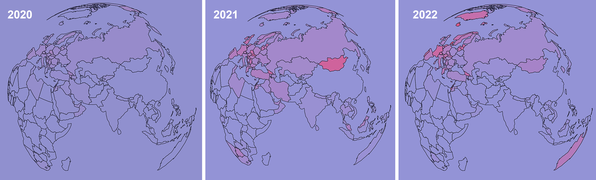
</p>

## <b>Narrative</b>

One possible narrative derived upon analysis of data using the dashboard  is presented below. 

<p align="center" width="100%">
    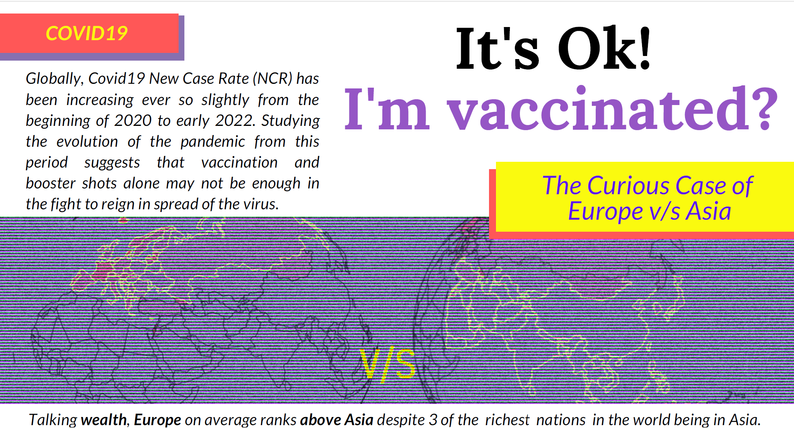
    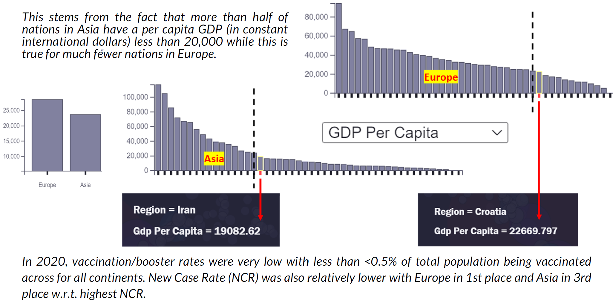
    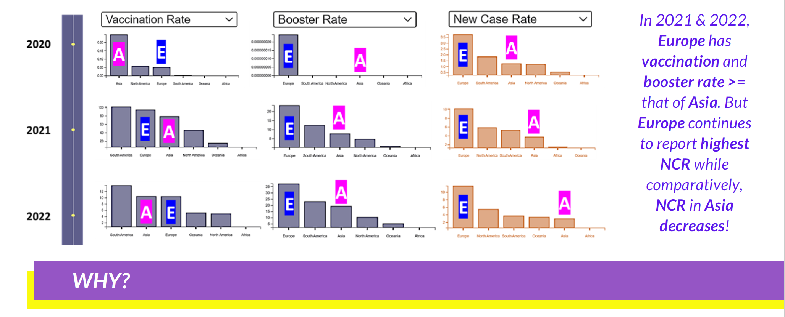
    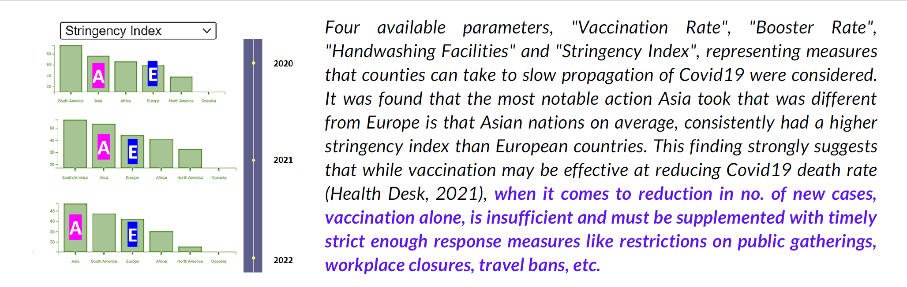
    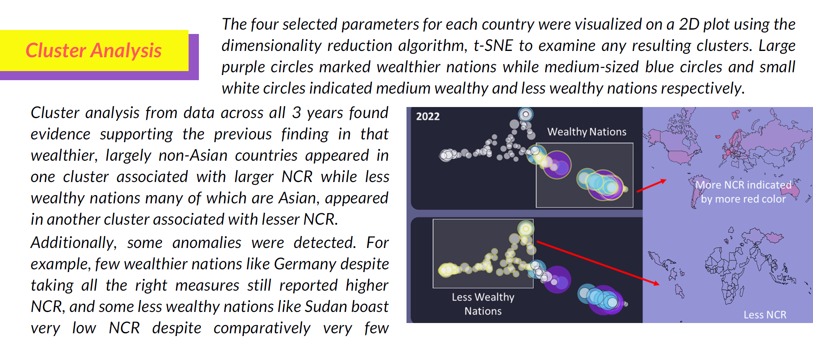
    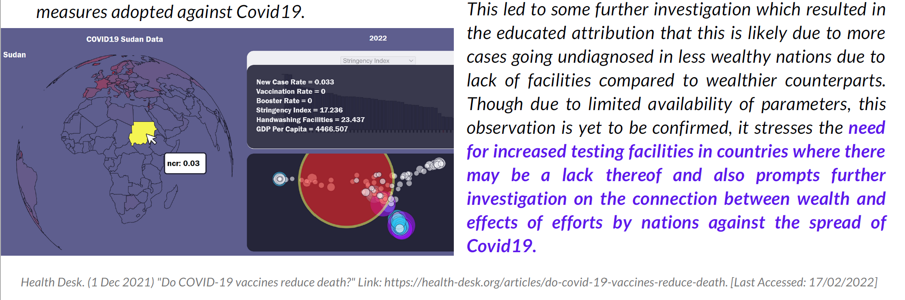
</p>

The above poster was designed on [www.canva.com](https://www.canva.com/features/) using only content from the dashboard.

## <b>Limitations and Possible Extensions</b>

1. Usually w.r.t. data story telling, a narrative is 1st developed based on insights gained after multiple rough visualizations of data before building the final dashboard that can take the viewer through the narrative (WordStream, 2022). But here, due to strict time constraints, there was a need to start with building the dashboard asap with lesser scope for in-depth data investigation and many visualization iterations that could result in a dashboard that's more catered towards one particular narrative. Thus, further investigation into why the results were as they were and changing of the dashboard display in tandem with new insights with possibly additional parameters displayed to help explain some trends better, was not possible in the given timeframe, especially since it is forbidden to alter dashboard content after demonstration.

2. Data had a lot of NaN values which got replaced with 0. Also, some attribute values were absent for a lot of countries that made results from these attributes not very usable. For example, "handwashing_facilities" attribute value was not available for most of the European countries. Thus, though visualized, this parameter did not play a large role in the narrative.

3. This dashboard can potentially be expanded to highlight regions specific to each bar when clicking on a bar in the bar chart in addition to the hover interaction present now.

4. An option to switch between globe and flat projections of map layout could also be added to make it easier to view the whole map at once as well as focus on certain parts of the globe with added intriguing interaction.

## References

<b>B</b>

* Barcelona Field Studies Center. (08 Jan 2022) <i>Data Presentation: Bar Graphs</i>. Link: https://geographyfieldwork.com/DataPresentationBarCharts.htm. [Last Accessed 18 Mar 2022]

**K**

* Karpathy, Piotrgrudzien. (2016) <i>tsnejs</i>, GitHub. Link: https://github.com/karpathy/tsnejs. [Last Accessed 20/03/2022]

<b>M</b>

* Michele Weigle. (8 Feb 2021) <i>Clustering Example with D3</i>, observable.com. Link: https://observablehq.com/@weiglemc/clustering-example-with-d3. [Last Accessed: 12/03/2022]

<b>R</b>

* Roundicons - Flaticon. <i>Info Button Image</i> from https://www.flaticon.com/free-icons/info. [Last Accessed: 15/03/2022]

**S**

* Stanford. (no date) <i>tSNEJS demo</i>. Link: https://cs.stanford.edu/people/karpathy/tsnejs/. [Last Accessed 20/03/2022]

<b>W</b>

* WordStream. (15 Mar 2022) <i>How to Persuade Your Audience With Data Storytelling</i>, wordstream.com. Link: https://www.wordstream.com/blog/ws/2021/05/27/data-storytelling. [Last Accessed: 18/03/2022].